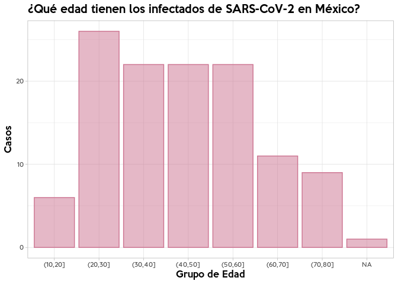

covidMex
================

Un paquete para obtener datos oficiales sobre casos de Covid-19 en
México. Creado por [Pablo Reyes](https://twitter.com/pablorm296).
Última actualizacion: **Wed Mar 18 18:45:20
2020**

## Build & Test Info :construction\_worker:

| platform             | arch    | os        | system             | status | major | minor | year | month | day | svn.rev | language | version.string               | nickname             |
| :------------------- | :------ | :-------- | :----------------- | :----- | :---- | :---- | :--- | :---- | :-- | :------ | :------- | :--------------------------- | :------------------- |
| x86\_64-pc-linux-gnu | x86\_64 | linux-gnu | x86\_64, linux-gnu |        | 3     | 6.3   | 2020 | 02    | 29  | 77875   | R        | R version 3.6.3 (2020-02-29) | Holding the Windsock |

## Instalación :package:

Para instalar el paquete, es necesario usar `install_github`, pues el
paquete no está disponible en la CRAN.

``` r
devtools::install_github("pablorm296/covidMex")
```

## Uso :question:

Para obtener los datos, usa la función `getData`. En ella puedes
especificar el tipo de reporte a cargar (casos confirmados o casos
sospechosos), así como la versión del reporte (fecha en que fue
publicado). Por default, `getData` descargará el reporte del día de
casos confirmados (`type = "suspect", date = "today"`). Si todavía no se
publica el reporte diario, `getData` descargará el reporte del día
anterior y notificará al usuario por medio de una `warning`.

``` r
library(covidMex)

# Descargar reporte de casos sospechosos
sospechosos <- getData(type = "suspect", date = "today")
```

    ## Warning in getData(type = "suspect", date = "today"): The specified date
    ## (2020-03-18) is not available... trying yesterday's date instead

    ## Parsed with column specification:
    ## cols(
    ##   `N° Caso` = col_character(),
    ##   Estado = col_character(),
    ##   Sexo = col_character(),
    ##   Edad = col_double(),
    ##   `Fecha de Inicio de síntomas` = col_character(),
    ##   `Identificación de COVID-19 por RT-
    ## PCR/Secuencia de DNA*` = col_character(),
    ##   Procedencia = col_character(),
    ##   `Fecha del llegada a México` = col_character()
    ## )

``` r
# Descargar reporte de casos confirmados
confirmados <- getData(type = "confirmed", date = "today")
```

    ## Warning in getData(type = "confirmed", date = "today"): The specified date
    ## (2020-03-18) is not available... trying yesterday's date instead

    ## Parsed with column specification:
    ## cols(
    ##   `N° Caso` = col_character(),
    ##   Estado = col_character(),
    ##   Sexo = col_character(),
    ##   Edad = col_double(),
    ##   `Fecha de Inicio de síntomas` = col_character(),
    ##   `Identificación de COVID-19
    ## por RT- PCR/Secuencia de DNA*` = col_character(),
    ##   Procedencia = col_character(),
    ##   `Fecha del llegada a México` = col_character()
    ## )

``` r
# Descarga una versión anterior del reprote
sospechosos_old <- getData(type = "suspect", date = "15/03/2020")
```

    ## Parsed with column specification:
    ## cols(
    ##   `N° Caso` = col_character(),
    ##   Estado = col_character(),
    ##   Sexo = col_character(),
    ##   Edad = col_double(),
    ##   `Fecha de Inicio de síntomas` = col_character(),
    ##   `Identificación de COVID-19 por RT-PCR/Secuencia de DNA*` = col_character(),
    ##   Procedencia = col_character(),
    ##   `Fecha del llegada a México` = col_character()
    ## )

``` r
confirmados %>%
  mutate_at("N° Caso", as.integer)  %>%
  mutate(GrupoEdad = cut(Edad, breaks = c(seq(0, 80, by = 10), Inf))) %>%
  ggplot() +
  geom_bar(aes(x = GrupoEdad, y = ..count..), colour = "#CC7390", 
           fill = "#CC7390", alpha = 0.5, na.rm = T) +
  labs(x = "Grupo de Edad", y = "Casos",
       title = "¿Qué edad tienen los infectados de SARS-CoV-2 en México?") +
  theme_light() + 
  theme(text = element_text(family = "Quicksand Medium"),
        title = element_text(family = "Keep Calm Med"))
```

    ## Warning: NAs introducidos por coerción

<!-- -->

Por el momento, `getData` descarga los datos de
*[Serendipia](https://serendipia.digital/2020/03/datos-abiertos-sobre-casos-de-coronavirus-covid-19-en-mexico/)*,
una iniciativa de periodismo de datos que ha publicado, en días
recientes, versiones .csv y .xlsx (creadas con
[I:heart:PDF](https://www.ilovepdf.com/es)) de los reportes publicados
por la Secretaría de Salud del Gobierno de México. En próximas
actualizaciones programaré un script que creará, automaticamente,
versiones .csv del reporte de SALUD y que serán accesibles a partir de
una API y de este paquete.

## TODO :white\_check\_mark:

  - \[ \] Write a ¿python? API to provide data. Evitar dependencia de la
    página de Serendipia.
