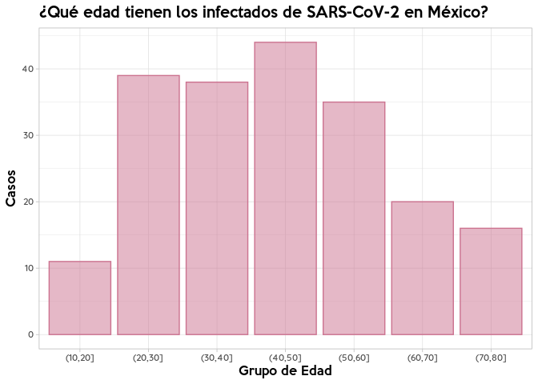

covidMex
================

Un paquete para obtener datos oficiales sobre casos de Covid-19 en
México. Creado por [Pablo Reyes](https://twitter.com/pablorm296).
Última actualizacion: **Thu Mar 19 16:54:23 2020**

## Instalación :package:

Para instalar el paquete, es necesario usar `install_github`, pues el
paquete no está disponible en la CRAN.

``` r
devtools::install_github("pablorm296/covidMex")
```

## Uso :question:

### Básicos

Para obtener los datos, usa la función `getData`. Usando el parámetro
`type` puedes especificar el tipo de reporte a cargar (casos confirmados
o casos sospechosos) y con el parámetro `date`especificas la versión del
reporte (fecha en que fue publicado). Por default, `getData` descargará
el reporte del día de casos confirmados (`type = "suspect", date =
"today"`). Si todavía no se publica el reporte diario, `getData`
descargará el reporte del día anterior y notificará al usuario por medio
de una `warning`.

``` r
library(covidMex)

# Descargar reporte de casos sospechosos
sospechosos <- getData(type = "suspect", source = "Serendipia")

# Descargar reporte de casos confirmados
confirmados <- getData(type = "confirmed")

# Descarga una versión anterior del reporte
sospechosos_old <- getData(type = "confirmed", date = "16/03/2020")
```

Por el momento, `getData` descarga los datos de dos fuentes:

1.  **Serendipia:**
    *[Serendipia](https://serendipia.digital/2020/03/datos-abiertos-sobre-casos-de-coronavirus-covid-19-en-mexico/)*,
    una iniciativa de periodismo de datos que ha publicado, en días
    recientes, versiones .csv y .xlsx (creadas con
    [I:heart:PDF](https://www.ilovepdf.com/es)) de los reportes
    publicados por la Secretaría de Salud del Gobierno de México.
2.  **covid19\_mex:** Un [repositorio en
    GitHub](https://github.com/guzmart/covid19_mex) creado por [Katia
    Guzmán Martínez](https://twitter.com/guzmart_). Katia, además de
    convertirlo en formarto abierto, hace una revisión manual del
    reporte publicado por la Secretaría de Salud del Gobierno de México.
    Por esta razón, esta fuente es la principal al momento de descargar
    la tabla de casos confirmados. **Esta fuente de datos sólo tiene
    tabla de casos confirmados**.

El usuario siempre puede especificar la fuente datos que desea usar con
el parámetro `source`, aunque por deafult, para casos confirmados se usa
el repositorio de Katia Guzmán y, para casos sospechosos, la página de
Serendipia

``` r
# Descargar reporte de casos confirmados 
# (Por defaul lo hará del repositorio de Katia)
confirmados <- getData(type = "confirmed")

# Descargar reporte de casos confirmados 
# (Podemos especificar que queremos el de Serendipia)
confirmados <- getData(type = "confirmed", source = "Serendipia")
```

Adicionalmente, cada vez que el usuario cargue el paquete, un mensaje le
notificará las fuentes de datos disponibles

``` r
library(covidMex)
```

    covidMex Package
    Versión: 0.2.0
    Last Update: 19/03/2020
    Available Data Sources:
        Confirmed Cases Table: Serendipia, Guzmart
        Suspect Cases Table: Serendipia

En próximas actualizaciones programaré un script que creará,
automaticamente, versiones .csv del reporte de SALUD y que serán
accesibles a partir de una API y de este paquete.

### Generando gráficas a partir de los datos

``` r
confirmados %>%
  mutate(GrupoEdad = cut(edad, breaks = c(seq(0, 80, by = 10), Inf))) %>%
  ggplot() +
  geom_bar(aes(x = GrupoEdad, y = ..count..), colour = "#CC7390", 
           fill = "#CC7390", alpha = 0.5, na.rm = T) +
  labs(x = "Grupo de Edad", y = "Casos",
       title = "¿Qué edad tienen los infectados de SARS-CoV-2 en México?") +
  theme_light() + 
  theme(text = element_text(family = "Quicksand Medium"),
        title = element_text(family = "Keep Calm Med"))
```

<!-- -->

## Fuentes

Las versiones *plain text* de los reportes de la Secretaría de Salud que
se usan en este paquete fueron publicadas originalmente en:

  - Redacción, “Datos abiertos sobre casos de Coronavirus COVID-19 en
    México”, en *Serendipia: Periodismo de datos*,
    <https://serendipia.digital/2020/03/datos-abiertos-sobre-casos-de-coronavirus-covid-19-en-mexico/>,
    consultado el 18 de marzo de 2020.

  - Katia Guzmán Martínez, “covid19\_mex: Publicación de datos oficiales
    (Secretaría de Salud) en formato amigable”, en *GitHub*, 16 de marzo
    de 2020, <https://github.com/guzmart/covid19_mex>, consultado el 18
    de marzo de 2020.

## Build & Test Info :construction\_worker:

**Probado
en:**

| platform             | arch    | os        | system             | status | major | minor | year | month | day | svn.rev | language | version.string               | nickname             |
| :------------------- | :------ | :-------- | :----------------- | :----- | :---- | :---- | :--- | :---- | :-- | :------ | :------- | :--------------------------- | :------------------- |
| x86\_64-pc-linux-gnu | x86\_64 | linux-gnu | x86\_64, linux-gnu |        | 3     | 6.3   | 2020 | 02    | 29  | 77875   | R        | R version 3.6.3 (2020-02-29) | Holding the Windsock |

**R CMD Check**:

    ## Updating covidMex documentation

    ## Writing NAMESPACE

    ## Loading covidMex

    ## covidMex Package

    ## Versión: 0.2.0

    ## Last Update: 19/03/2020

    ## Available Data Sources:

    ##     Confirmed Cases Table: Serendipia, Guzmart

    ##     Suspect Cases Table: Serendipia

    ## Writing NAMESPACE
    ## ── Building ──────────────────────────────────────────────────────────────────────────────────────────────────────────────── covidMex ──
    ## Setting env vars:
    ## ● CFLAGS    : -Wall -pedantic
    ## ● CXXFLAGS  : -Wall -pedantic
    ## ● CXX11FLAGS: -Wall -pedantic
    ## ────────────────────────────────────────────────────────────────────────────────────────────────────────────────────────────────────────
    ##   
       checking for file ‘/media/preyes/EHDD2/R/covidMex/covidMex/DESCRIPTION’ ...
      
    ✔  checking for file ‘/media/preyes/EHDD2/R/covidMex/covidMex/DESCRIPTION’
    ## 
      
    ─  preparing ‘covidMex’:
    ## 
      
       checking DESCRIPTION meta-information ...
      
    ✔  checking DESCRIPTION meta-information
    ## 
      
    ─  checking for LF line-endings in source and make files and shell scripts
    ## 
      
    ─  checking for empty or unneeded directories
    ## 
      
    ─  building ‘covidMex_0.2.0.tar.gz’
    ## 
      
       
    ## 
    ── Checking ──────────────────────────────────────────────────────────────────────────────────────────────────────────────── covidMex ──
    ## Setting env vars:
    ## ● _R_CHECK_CRAN_INCOMING_USE_ASPELL_: TRUE
    ## ● _R_CHECK_CRAN_INCOMING_REMOTE_    : FALSE
    ## ● _R_CHECK_CRAN_INCOMING_           : FALSE
    ## ● _R_CHECK_FORCE_SUGGESTS_          : FALSE
    ## ── R CMD check ────────────────────────────────────────────────────────────
    ##   
    ─  using log directory ‘/tmp/RtmpcZBR87/covidMex.Rcheck’
    ## 
      
    ─  using R version 3.6.3 (2020-02-29)
    ## ─  using platform: x86_64-pc-linux-gnu (64-bit)
    ## ─  using session charset: UTF-8
    ## 
      
    ─  using options ‘--no-manual --as-cran’
    ## 
      
    ✔  checking for file ‘covidMex/DESCRIPTION’
    ## ─  checking extension type ... Package
    ## 
      
    ─  this is package ‘covidMex’ version ‘0.2.0’
    ## ─  package encoding: UTF-8
    ## 
      
       checking package namespace information ...
      
    ✔  checking package namespace information
    ## 
      
       checking package dependencies ...
      
    ✔  checking package dependencies (1.1s)
    ## 
      
    ✔  checking if this is a source package
    ## ✔  checking if there is a namespace
    ## 
      
       checking for executable files ...
      
    ✔  checking for executable files
    ## 
      
    ✔  checking for hidden files and directories
    ##    checking for portable file names ...
      
    ✔  checking for portable file names
    ## ✔  checking for sufficient/correct file permissions
    ## 
      
    ✔  checking serialization versions
    ##    checking whether package ‘covidMex’ can be installed ...
      
    ✔  checking whether package ‘covidMex’ can be installed (2.1s)
    ## 
      
       checking installed package size ...
      
    ✔  checking installed package size
    ## 
      
       checking package directory ...
      
    ✔  checking package directory
    ##    checking for future file timestamps ...
      
    ✔  checking for future file timestamps (719ms)
    ## 
      
       checking DESCRIPTION meta-information ...
      
    N  checking DESCRIPTION meta-information
    ## 
      
       Malformed Description field: should contain one or more complete sentences.
    ## 
      
       Non-standard license specification:
    ##      Creative Commons Attribution-NonCommercial-ShareAlike 4.0
    ##      International License
    ##    Standardizable: FALSE
    ## 
      
       checking top-level files ...
      
    N  checking top-level files
    ##    Non-standard files/directories found at top level:
    ## 
      
         ‘README.Rmd’ ‘README_files’
    ## ✔  checking for left-over files
    ## ✔  checking index information
    ##    checking package subdirectories ...
      
    ✔  checking package subdirectories
    ## 
      
       checking R files for non-ASCII characters ...
      
    W  checking R files for non-ASCII characters
    ## 
      
       Found the following file with non-ASCII characters:
    ##      zzz.R
    ##    Portable packages must use only ASCII characters in their R code,
    ##    except perhaps in comments.
    ##    Use \uxxxx escapes for other characters.
    ##    checking R files for syntax errors ...
      
    ✔  checking R files for syntax errors
    ## 
      
       checking whether the package can be loaded ...
      
    ✔  checking whether the package can be loaded (463ms)
    ## 
      
       checking whether the package can be loaded with stated dependencies ...
      
    ✔  checking whether the package can be loaded with stated dependencies (374ms)
    ## 
      
       checking whether the package can be unloaded cleanly ...
      
    ✔  checking whether the package can be unloaded cleanly (382ms)
    ## 
      
       checking whether the namespace can be loaded with stated dependencies ...
      
    ✔  checking whether the namespace can be loaded with stated dependencies (370ms)
    ## 
      
       checking whether the namespace can be unloaded cleanly ...
      
    ✔  checking whether the namespace can be unloaded cleanly (446ms)
    ## 
      
       checking loading without being on the library search path ...
      
    ✔  checking loading without being on the library search path (484ms)
    ## 
      
       checking dependencies in R code ...
      
    ✔  checking dependencies in R code (379ms)
    ## 
      
       checking S3 generic/method consistency ...
      
    ✔  checking S3 generic/method consistency (744ms)
    ## 
      
       checking replacement functions ...
      
    ✔  checking replacement functions (382ms)
    ## 
      
       checking foreign function calls ...
      
    ✔  checking foreign function calls (402ms)
    ## 
      
       checking R code for possible problems ...
      
    N  checking R code for possible problems (2.6s)
    ##    GetFromGuzmart: no visible global function definition for
    ##      ‘packageVersion’
    ##    GetFromSerendipia: no visible global function definition for
    ##      ‘packageVersion’
    ##    Undefined global functions or variables:
    ##      packageVersion
    ##    Consider adding
    ##      importFrom("utils", "packageVersion")
    ##    to your NAMESPACE file.
    ## 
      
       checking Rd files ...
      
    ✔  checking Rd files
    ## 
      
       checking Rd metadata ...
      
    ✔  checking Rd metadata
    ## 
      
       checking Rd line widths ...
      
    N  checking Rd line widths
    ##    Rd file 'GetFromGuzmart.Rd':
    ##      \usage lines wider than 90 characters:
    ##           GetFromGuzmart(targetURL = "https://github.com/guzmart/covid19_mex/raw/master/01_datos/",
    ##    
    ##    Rd file 'GetFromSerendipia.Rd':
    ##      \usage lines wider than 90 characters:
    ##           GetFromSerendipia(targetURL = "https://serendipia.digital/2020/03/datos-abiertos-sobre-casos-de-coronavirus-covid-19-en-mexico/",
    ##    
    ## 
      
       These lines will be truncated in the PDF manual.
    ##    checking Rd cross-references ...
      
    ✔  checking Rd cross-references (442ms)
    ## 
      
       checking for missing documentation entries ...
      
    ✔  checking for missing documentation entries (392ms)
    ## 
      
       checking for code/documentation mismatches ...
      
    W  checking for code/documentation mismatches (384ms)
    ##    Functions or methods with usage in documentation object 'hello' but not in code:
    ##      ‘hello’
    ##    
    ## 
      
       checking Rd \usage sections ...
      
    ✔  checking Rd \usage sections (1.5s)
    ## 
      
       checking Rd contents ...
      
    ✔  checking Rd contents
    ## 
      
       checking for unstated dependencies in examples ...
      
    ✔  checking for unstated dependencies in examples
    ## 
      
       checking examples ...
      
    E  checking examples (796ms)
    ## 
      
       
    ##    See
    ##      ‘/tmp/RtmpcZBR87/covidMex.Rcheck/00check.log’
    ##    for details.
    ##    
    ## 
      
       Running examples in ‘covidMex-Ex.R’ failed
    ##    The error most likely occurred in:
    ##    
    ##    > base::assign(".ptime", proc.time(), pos = "CheckExEnv")
    ##    > ### Name: hello
    ##    > ### Title: Hello, World!
    ##    > ### Aliases: hello
    ##    > 
    ##    > ### ** Examples
    ##    > 
    ##    > hello()
    ##    Error in hello() : could not find function "hello"
    ##    Execution halted
    ## ✔  checking for detritus in the temp directory
    ## 

    ## ── R CMD check results ──────────────────────────────── covidMex 0.2.0 ────
    ## Duration: 15.6s
    ## 
    ## ❯ checking examples ... ERROR
    ##   Running examples in ‘covidMex-Ex.R’ failed
    ##   The error most likely occurred in:
    ##   
    ##   > base::assign(".ptime", proc.time(), pos = "CheckExEnv")
    ##   > ### Name: hello
    ##   > ### Title: Hello, World!
    ##   > ### Aliases: hello
    ##   > 
    ##   > ### ** Examples
    ##   > 
    ##   > hello()
    ##   Error in hello() : could not find function "hello"
    ##   Execution halted
    ## 
    ## ❯ checking R files for non-ASCII characters ... WARNING
    ##   Found the following file with non-ASCII characters:
    ##     zzz.R
    ##   Portable packages must use only ASCII characters in their R code,
    ##   except perhaps in comments.
    ##   Use \uxxxx escapes for other characters.
    ## 
    ## ❯ checking for code/documentation mismatches ... WARNING
    ##   Functions or methods with usage in documentation object 'hello' but not in code:
    ##     ‘hello’
    ## 
    ## ❯ checking DESCRIPTION meta-information ... NOTE
    ##   Malformed Description field: should contain one or more complete sentences.
    ##   Non-standard license specification:
    ##     Creative Commons Attribution-NonCommercial-ShareAlike 4.0
    ##     International License
    ##   Standardizable: FALSE
    ## 
    ## ❯ checking top-level files ... NOTE
    ##   Non-standard files/directories found at top level:
    ##     ‘README.Rmd’ ‘README_files’
    ## 
    ## ❯ checking R code for possible problems ... NOTE
    ##   GetFromGuzmart: no visible global function definition for
    ##     ‘packageVersion’
    ##   GetFromSerendipia: no visible global function definition for
    ##     ‘packageVersion’
    ##   Undefined global functions or variables:
    ##     packageVersion
    ##   Consider adding
    ##     importFrom("utils", "packageVersion")
    ##   to your NAMESPACE file.
    ## 
    ## ❯ checking Rd line widths ... NOTE
    ##   Rd file 'GetFromGuzmart.Rd':
    ##     \usage lines wider than 90 characters:
    ##          GetFromGuzmart(targetURL = "https://github.com/guzmart/covid19_mex/raw/master/01_datos/",
    ##   
    ##   Rd file 'GetFromSerendipia.Rd':
    ##     \usage lines wider than 90 characters:
    ##          GetFromSerendipia(targetURL = "https://serendipia.digital/2020/03/datos-abiertos-sobre-casos-de-coronavirus-covid-19-en-mexico/",
    ##   
    ##   These lines will be truncated in the PDF manual.
    ## 
    ## 1 error ✖ | 2 warnings ✖ | 4 notes ✖

## TODO :white\_check\_mark:

  - \[ \] Write a ¿python? API to provide data. Evitar dependencia de la
    página de
Serendipia.

## Licencia

<a rel="license" href="http://creativecommons.org/licenses/by-nc-sa/4.0/"></a><br />Esta
obra está bajo una
<a rel="license" href="http://creativecommons.org/licenses/by-nc-sa/4.0/">Licencia
Creative Commons Atribución-NoComercial-CompartirIgual 4.0
Internacional</a>
